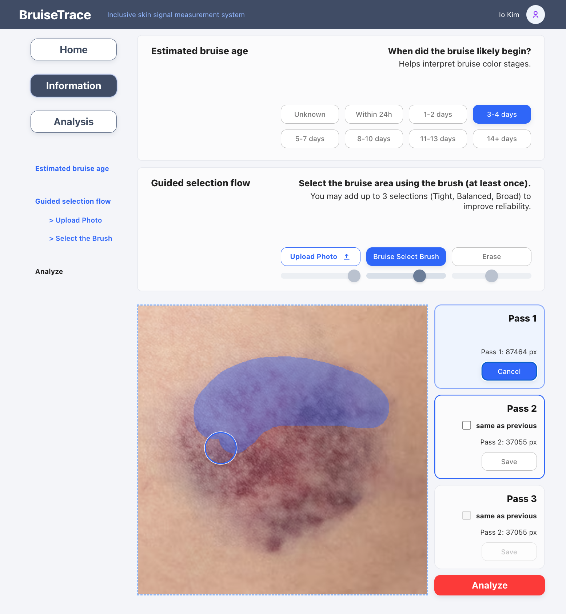
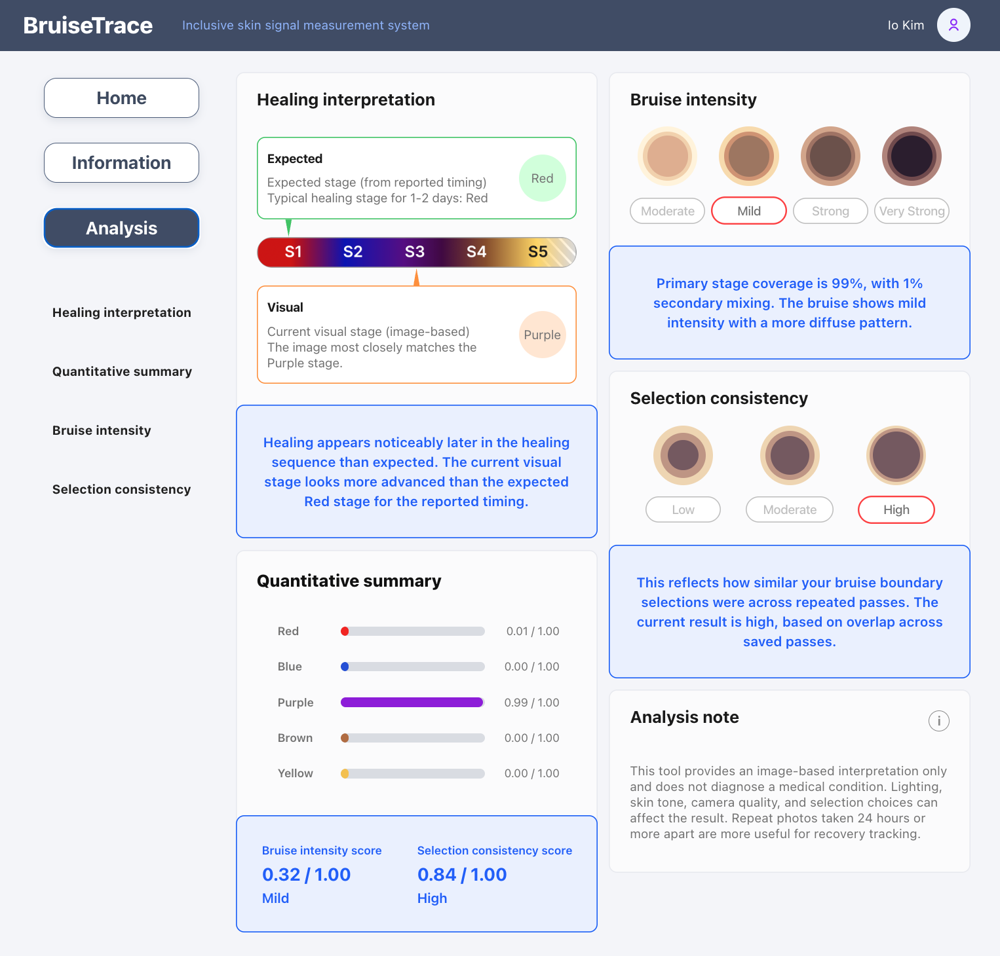
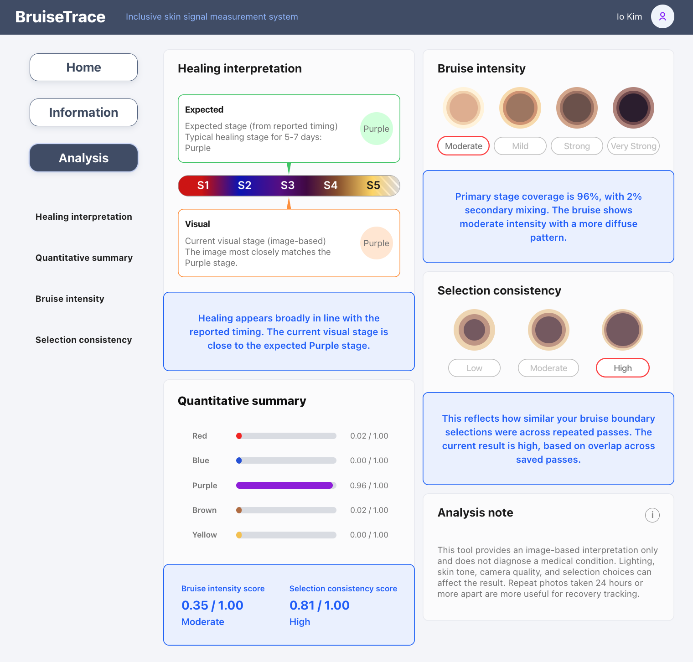
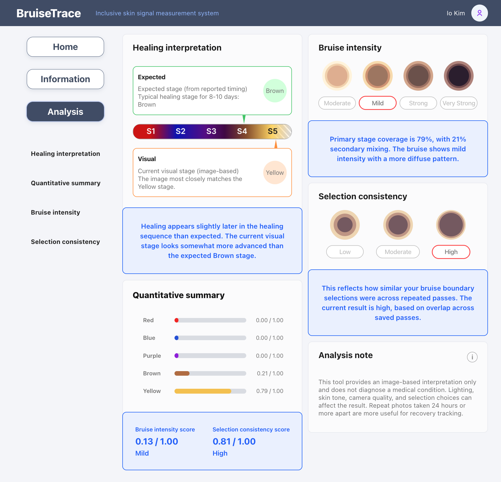

# BruiseTrace

AI-powered bruise analysis tool designed to support inclusive skin tone assessment.

BruiseTrace explores how image analysis and user-guided segmentation can help track bruise development more clearly across different skin tones.

---

## Prototype (v0.4)

### Information & Guided Selection

---

### Analysis Results

#### Case 1 — Healing mismatch (expected vs visual difference)

#### Case 2 — Healing aligned (expected ≈ visual)

#### Case 3 — Late-stage yellow bruise detection

---

## Live Demo
https://bruisetrace.vercel.app

---

## Problem

Bruises can appear differently across skin tones and lighting conditions.  
Many visual assessment tools are not designed with inclusive skin analysis in mind.

---

## Approach

- User-guided bruise region selection (3-pass system: Tight, Balanced, Broad)
- Color stage estimation (S1–S5 progression)
- Bruise intensity scoring
- Selection consistency scoring
- Canvas-based image analysis

---

## Development Status

Current version: **v0.4 (analysis refinement + improved interpretation)**

Planned improvements:
- Intensity algorithm enhancement
- Quantitative summary calibration
- ROI segmentation refinement
- Recovery tracking (multi-image timeline)
