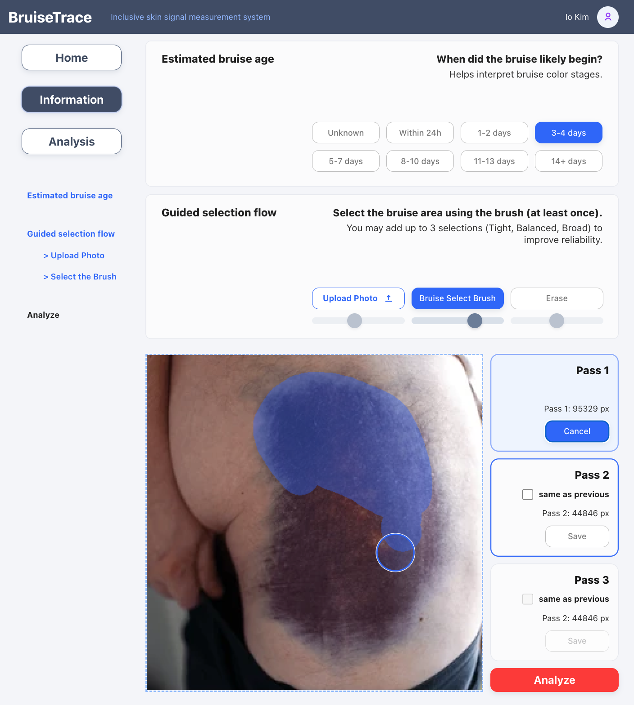
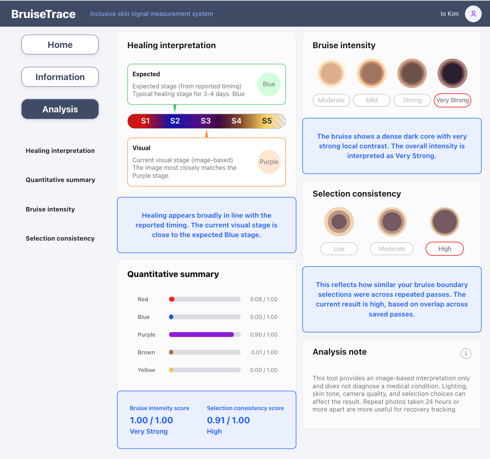
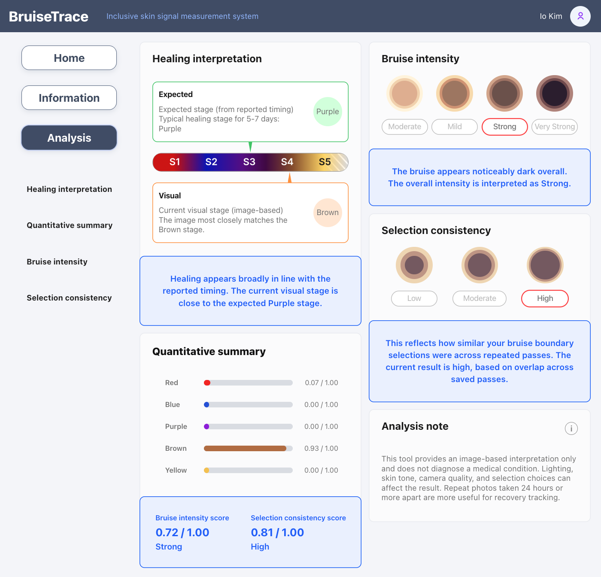
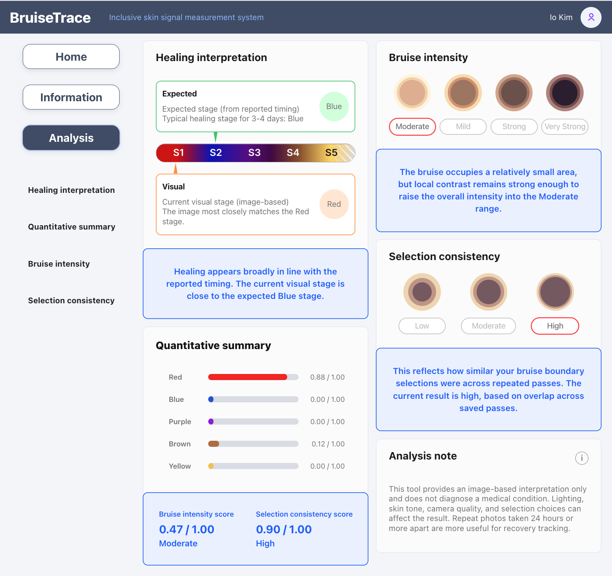
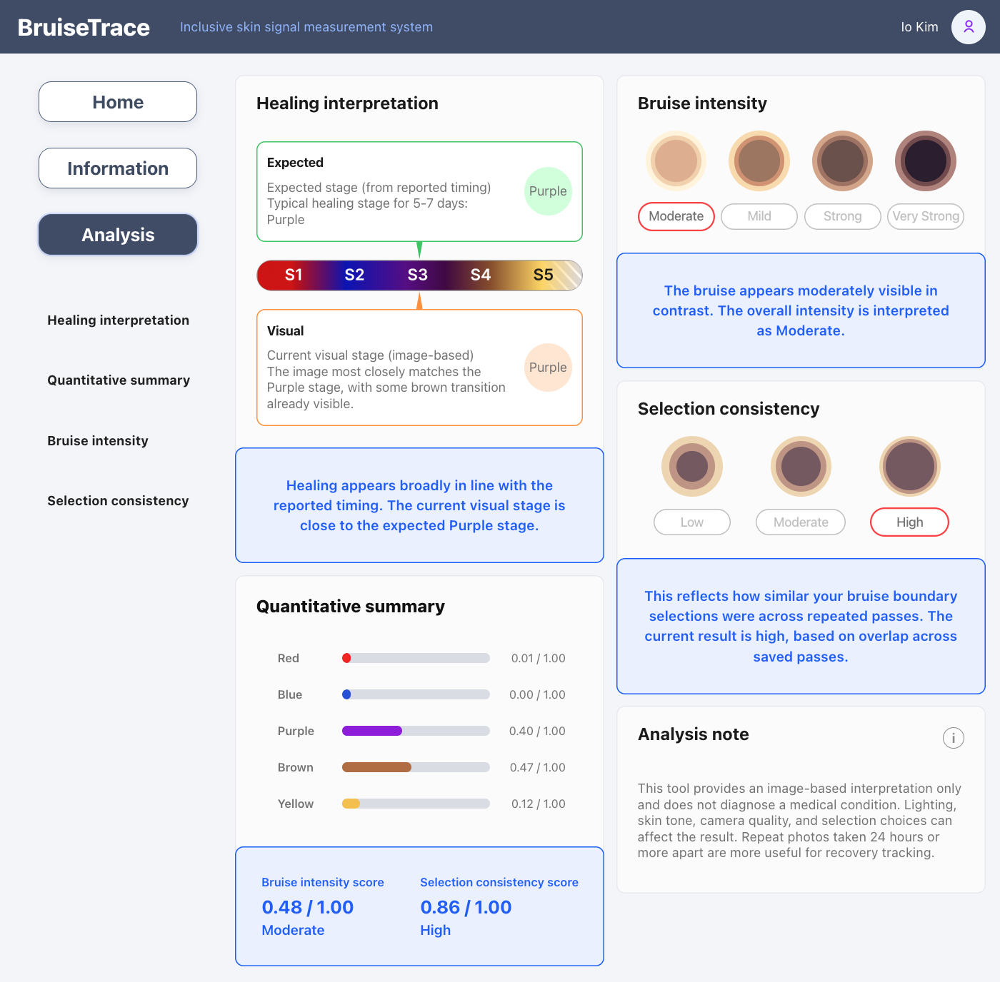

## 📸 Example Analysis Results

### 1. Guided Selection (User Interaction)

Users manually select the bruise region using a brush-based interface.  
Multiple passes can be used to improve selection reliability.

---

### 2. Very Strong Intensity (Dense Dark Core)

A dense dark core with high local contrast leads to a **Very Strong** intensity classification.  
The visual stage (Purple) is close to the expected healing stage.

---

### 3. Strong Intensity (Brown Dominant Stage)

The bruise shows a strong brown dominance, indicating progression into a later healing phase.  
The system interprets this as **Strong intensity** with consistent selection overlap.

---

### 4. Stage Mismatch Detection (Red vs Expected Blue)

The visual stage appears **earlier than expected** (Red vs expected Blue).  
This suggests slower healing progression based on reported timing.

---

### 5. Transition Stage (Purple → Brown)

Mixed color signals (Purple with Brown transition) indicate an ongoing healing shift.  
The model captures this transition rather than forcing a single-stage classification.
